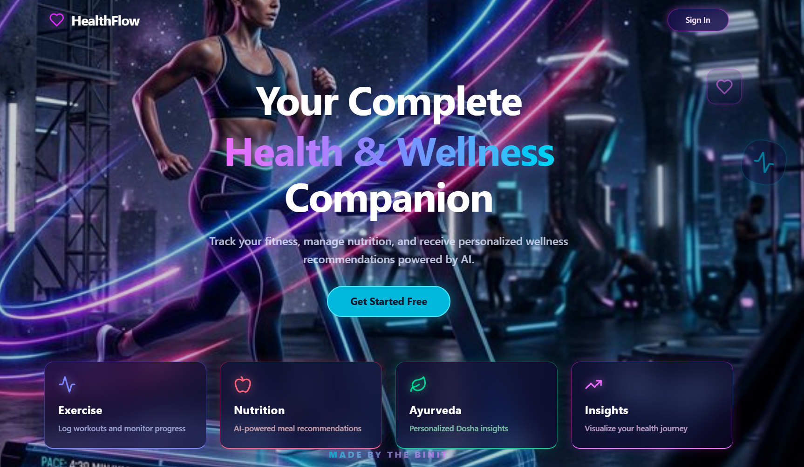
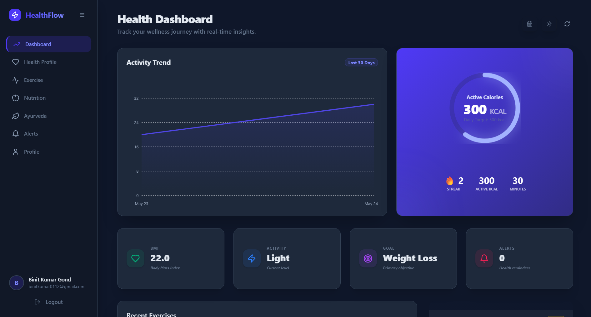
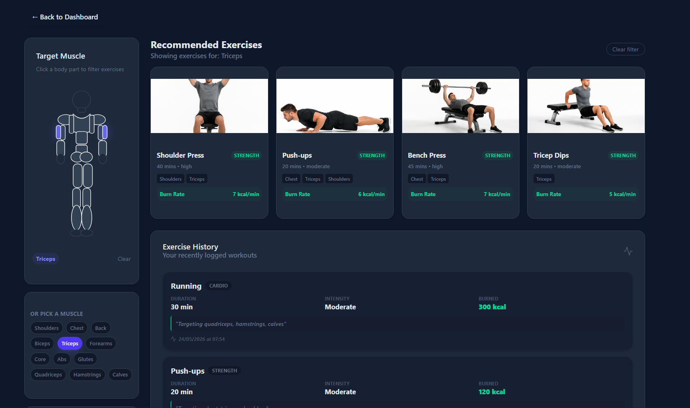

# Fitness Tracker System

A full-stack fitness and health tracking platform with authentication, real-time tracking, and personalized health insights.

## 🚀 Features

- 🔐 Firebase Authentication (secure login/signup)
- 📊 Health Dashboard with analytics and progress tracking
- 🏋️ Workout & Exercise Tracking system
- 🥗 Smart Diet Planner with AI-powered meal recommendations
- 🍽️ Nutrition tracking with macros (protein, carbs, fats)
- 🧠 Smart Health Insights & Alert System (daily score, warnings, suggestions)
- 🧬 Ayurvedic Health Assessment System (Dosha-based insights)
- ⚡ Real-time data fetching using tRPC
- 🗄️ PostgreSQL (Supabase) with Drizzle ORM
- 🎨 Modern UI with React + Tailwind
- 🚀 CI/CD with GitHub Actions
- 🌐 Deployed on Vercel + Render
---

## 🖼️ Screenshots

### 🏠 Homepage
Modern AI-powered fitness landing page with clean UI and feature highlights.

---

### 📊 Dashboard
Track health metrics, workouts, and progress in a centralized dashboard.

---

### 🏋️ Workout Tracking
Log exercises and monitor workout performance over time.

## 🌐 Live Demo

👉 https://fitness-tracker-system.vercel.app

### Frontend
- React
- Vite
- TailwindCSS
- TanStack Query

### Backend
- Node.js
- Express
- tRPC API layer

### Database
- PostgreSQL (Supabase)
- Drizzle ORM

### Authentication
- Firebase Auth

### DevOps & Infrastructure
- GitHub Actions (CI/CD)
- Vercel (Frontend Deployment)
- Render (Backend Deployment)
- Supabase (Managed Database)

## 🏗️ Architecture

This project follows a full-stack modular architecture using React, Express, and tRPC for type-safe communication.

👉 For detailed system design, see [ARCHITECTURE.md](./ARCHITECTURE.md)

## 📁 Project Structure

client/      → Frontend (React + Vite)
server/      → Backend (Express + tRPC)
shared/      → Shared types & schemas
drizzle/     → Database schema & migrations
scripts/     → Utility & debug scripts
screenshots/ → README assets
